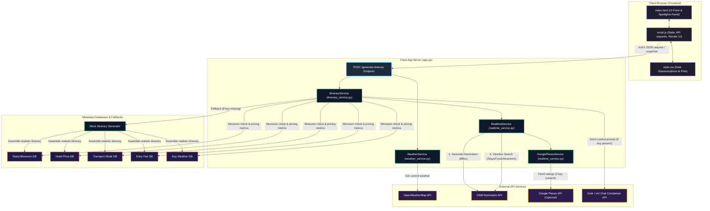

# Implementation Process - Real-Time Travel Data Integration

This document outlines the step-by-step process used to implement the real-time travel data integration (accommodations, restaurants, and attractions) for the RoamAI Travel Planner application.

---

## Step 1: External API Selection & Design
* **Goal**: Find a robust, keyless, and free external search API that returns structured coordinates, accommodations, restaurants, and attractions for any destination worldwide.
* **Selection**: The **OpenStreetMap (OSM) Nominatim Search API** was chosen because it meets all requirements, is free to use under OSM policies, and requires no private credentials or developer registration.

---

## Step 2: Implementation of the API Service
* **File created**: [`backend/realtime_service.py`](file:///c:/Users/777dh/Downloads/travel-planner/backend/realtime_service.py)
* **Design & Logic**:
  1. Resolves the destination keyword (e.g., "Goa" or "Paris") to retrieve its official `display_name` and geographical `boundingbox` `[south, north, west, east]`.
  2. Executes three localized viewbox search queries strictly bounded inside that destination's limits:
     * `q=hotel` (to fetch stays)
     * `q=restaurant` (to fetch food spots)
     * `q=attraction` & `q=monument` (to fetch landmarks/sightseeing spots)
  3. Maps the raw data into clean, formatted JSON arrays: `{ "name": "...", "address": "..." }`.
  4. Configures a browser-compatible `User-Agent` header to satisfy OSM security and avoid rate-limiting/blocking (`HTTP 403 Forbidden`).

---

## Step 3: Integrating Real-Time Data into Itineraries
* **File modified**: [`backend/itinerary_service.py`](file:///c:/Users/777dh/Downloads/travel-planner/backend/itinerary_service.py)
* **Design & Logic**:
  1. Instantiates `RealtimeService` inside the constructor.
  2. Fetches the real-time spotlights data for the user's destination inside the `generate_itinerary` wrapper.
  3. **For LLM Mode**: Appends the real hotel, restaurant, and landmark names as context in the prompt and instructs the LLM to write the itinerary utilizing these actual locations and recommend local food dishes for the matched restaurants.
  4. **For Mock Fallback Mode**: Updates the generation script to dynamically pull random items from the real-time lists and weave them into the daily morning, afternoon, evening, stay, and food descriptions, instead of using static placeholder templates.

---

## Step 4: Exposing Data to the Frontend
* **File modified**: [`backend/app.py`](file:///c:/Users/777dh/Downloads/travel-planner/backend/app.py)
* **Design & Logic**: Intercepts the generated itinerary packet, pulls the resolved `realtime_data` (containing list arrays for hotels, restaurants, and spots), and packages it into the `/generate-itinerary` endpoint JSON response payload.

---

## Step 5: Rendering the Real-Time Spotlights Card
* **File modified**: [`frontend/index.html`](file:///c:/Users/777dh/Downloads/travel-planner/frontend/index.html)
  * Added a modern glassmorphic card named **Real-Time Local Spotlights** directly between the header banner and the daily itinerary timeline container.
  * Inside the card, configured tab buttons (`Stay Recommendations`, `Local Restaurants`, and `Top Attractions`) and matching target lists to hold the resolved arrays.

* **File modified**: [`frontend/script.js`](file:///c:/Users/777dh/Downloads/travel-planner/frontend/script.js)
  * Extracted lists from the API response and populated the respective tabs in the spotlights card.
  * Injected an `Accommodation Stay` timeline node at the beginning of each day card's timeline.
  * Added the tab-switching mechanics (`switchSpotlightTab`) to switch between the categories smoothly.

---

## Step 6: Polishing Aesthetics and Print Settings
* **File modified**: [`frontend/style.css`](file:///c:/Users/777dh/Downloads/travel-planner/frontend/style.css)
  * Designed glassmorphic tab buttons with active neon glow borders, smooth transitions, and distinct colors for tab icons.
  * Structured timeline entries to render with custom icons (purple hotel bed for stays, red fork-knife for dining) and clean margins.
  * Configured `@media print` directives to omit the interactive tab buttons from PDF downloads while exporting active list items and daily itineraries onto standard printable formatting.

---

## Step 7: Local Validation
* Cleaned up debug test scripts and launched automated browser simulation runs to verify tab clicks, coordinate resolution, and layout responsiveness.

---

## System Architecture & Data Flow

Below is the detailed architecture and logical execution flow of the travel planner application.

### 1. System Component Architecture

### 2. Implementation Execution Flow

```mermaid
flowchart TD
    classDef startEnd fill:#111827,stroke:#6b7280,stroke-width:2px,color:#fff;
    classDef process fill:#1e293b,stroke:#3b82f6,stroke-width:2px,color:#fff;
    classDef decision fill:#312e81,stroke:#818cf8,stroke-width:2px,color:#fff;
    classDef error fill:#7f1d1d,stroke:#ef4444,stroke-width:2px,color:#fff;

    Start(["User submits search form"]):::startEnd --> Val{"Input valid?"}:::decision
    Val -- "No (invalid values)" --> Err["Return HTTP 400 Validation Error"]:::error
    Val -- "Yes" --> Req["POST payload sent to Flask /generate-itinerary"]:::process

    Req --> WeatherReq["Fetch Destination Weather"]:::process
    WeatherReq --> HasWKey{"OpenWeatherMap Key?"}:::decision
    HasWKey -- "Yes" --> FetchOWM["Query OpenWeatherMap API"]:::process
    HasWKey -- "No / Fails" --> MockW["Generate deterministic Mock weather"]:::process

    FetchOWM --> RealtimeReq["Fetch Real-Time Spotlight Data"]:::process
    MockW --> RealtimeReq

    RealtimeReq --> ResolveLoc["Geolocate boundingbox via OSM Nominatim"]:::process
    ResolveLoc --> QueryOSM["Run viewbox query for: Hotels, Restaurants, Attractions"]:::process
    QueryOSM --> EnrichListings["Enrich listings with reviews, maps links & food dishes"]:::process

    EnrichListings --> HasGKey{"Google Places Key?"}:::decision
    HasGKey -- "Yes" --> QueryGPlaces["Query ratings & reviews from Google"]:::process
    HasGKey -- "No / Fails" --> HashRating["Generate OSM hash-based rating"]:::process

    QueryGPlaces --> ItinGen["Execute Itinerary Logic"]:::process
    HashRating --> ItinGen

    ItinGen --> CheckRain["Check travel date vs RAINY_MONSOON_DB"]:::process
    CheckRain --> GetTiers["Compute Pricing Tiers (Hotel, Food, Transport, Entry Fees)"]:::process

    GetTiers --> HasLlmKey{"Grok/xAI Key set?"}:::decision
    HasLlmKey -- "Yes" --> CallGrok["Send context prompt to xAI API (JSON Mode)"]:::process
    HasLlmKey -- "No / Fails" --> FallbackMock["Call _generate_mock_itinerary fallback"]:::process

    CallGrok --> RespOrFallback{"API response ok?"}:::decision
    RespOrFallback -- "Yes" --> ParseJson["Parse itinerary JSON"]:::process
    RespOrFallback -- "No" --> FallbackMock

    FallbackMock --> ComputeSplit["Calculate exact day accommodation, food, activities & transport splits"]:::process
    ComputeSplit --> AssembleJson["Generate complete structured mock itinerary JSON"]:::process

    ParseJson --> APIResponse["Respond with unified JSON payload to Client"]:::process
    AssembleJson --> APIResponse

    APIResponse --> RenderUI["JS renders UI: Spotlight tabs, Daily cards, Weather & Safety tips"]:::process
    RenderUI --> End(["Interactive Planner page rendered"]):::startEnd
```

